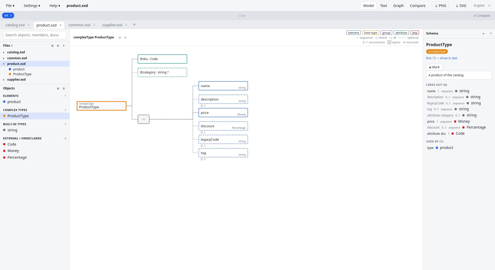
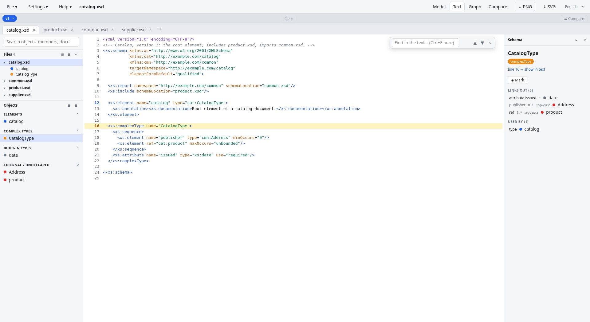
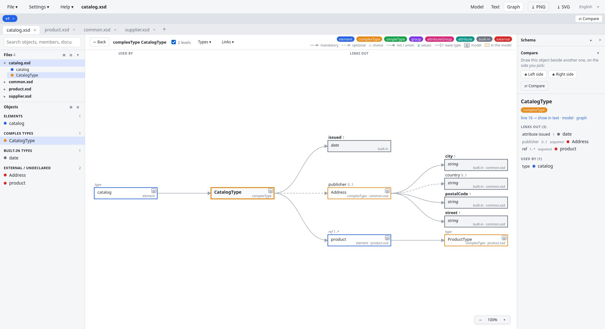
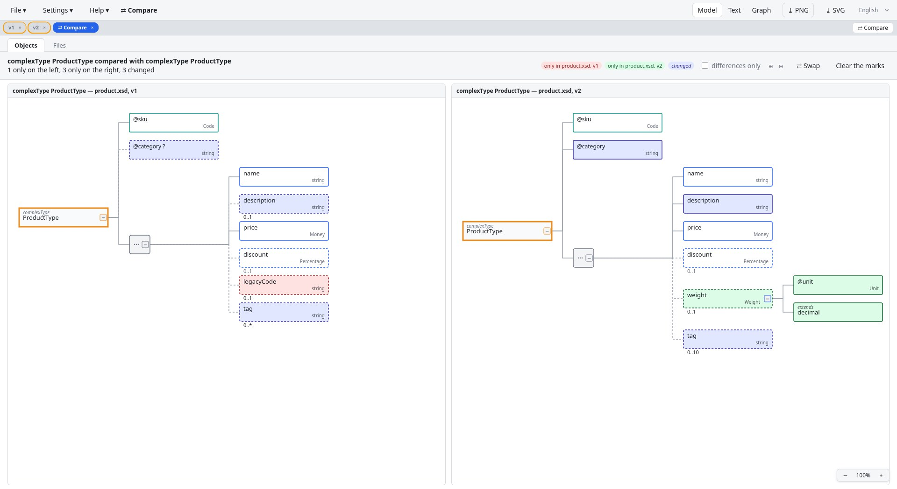
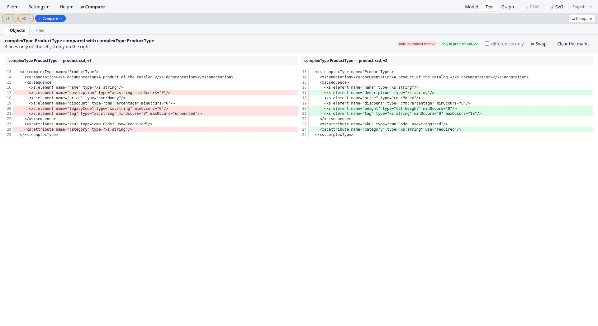
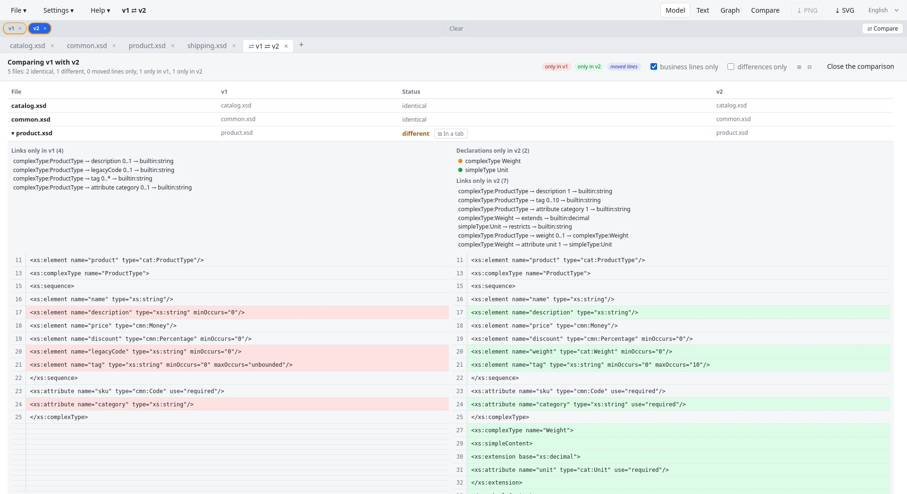
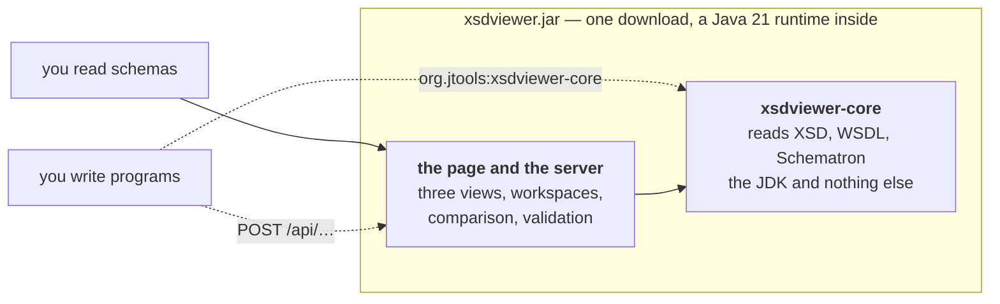

# XsdViewer

[](https://github.com/j4ckk0/XsdViewer/actions/workflows/build.yml)
[](https://central.sonatype.com/artifact/org.jtools/xsdviewer-core)

**See what a schema says.** XsdViewer draws an XML Schema the way you think about it: what a
document of it holds, how its declarations refer to one another, what changed between two versions
— in your browser, from one file you download. It reads WSDL services and Schematron rules the same way.

| | |
|---|---|
| You read or write schemas | [**1. The application**](#1-the-application) — download it, run it, look |
| You write programs that read schemas | [**2. The library**](#2-a-library-on-maven-central) — `org.jtools:xsdviewer-core`, and the HTTP API |
| You want to read or change the code | [**3. The code**](#3-the-open-source-code) and [**4. The architecture**](#4-the-architecture) |

## 1. The application

[**Download the latest release**](https://github.com/j4ckk0/XsdViewer/releases/latest) for Windows,
Linux or macOS — nothing to install, a Java runtime is inside —, unpack it anywhere, start the
launcher: the page opens in your browser. Drop a schema on it.

### Screenshots

**Model view** — `ProductType` of `product.xsd`: what a document of it holds. Its attributes
first (`@sku : Code`, `@category` optional, marked `?`), then its sequence and the elements it
holds, each with its type in the corner and its occurrences below, dashed when optional. A named
type, a global element or a base type carries a **+** handle that opens its own content in place,
taken from its declaration wherever it lives — so a model can be read across files.



**Text view** — the source of `catalog.xsd`, the selected object's declaration highlighted;
clicking a line number selects that object, and Ctrl+F searches the text.



**Graph view** — the other question: not what a document holds, but how the declarations refer to
one another. `CatalogType` in the centre, what it links to on the right (two levels: `publisher`
is an `Address` from `common.xsd`, expanded from its own tab), what uses it on the left;
cardinalities after each link, optional links dashed. The details panel on the right lists the
links and the documentation — and, for an enumeration (a simpleType, an element or an attribute
restricted to `xs:enumeration` values), the values with their own documentation.



**Comparing two declarations** — side by side, wherever each of them lives. Here `ProductType`
of `v1` against the one of `v2`, marked one after the other: `legacyCode` is only in `v1` (red),
`weight` only in `v2` (green, its own type opened), and `@category`, `description` and `tag`
changed their occurrences (blue). The two need not share a name, a file or a workspace.



**The same two declarations as text** — the Objects section draws its pair the way its own
**Model / Text / Graph** switch asks. Here their source alone, cut out of each file and kept at its
own line numbers, the four differing lines marked. **Graph** shows instead the neighbourhood of each,
the links only one side has marked; **Differences only** keeps, in whichever view, just what differs.



**Comparing two workspaces** — `v1` against `v2` of the same schema set: file by file, the
declarations and links only on one side, then the two sources side by side.



### Main features

- **Three views of a file**, each answering a different question. **Model** says what a document of
  the selected declaration holds — its shape, as an XSD editor draws it; this is the view a tab
  opens on. **Text** is the source itself, where that declaration is written. **Graph** says how the
  declarations of the file refer to one another around the selected one: the map of the file, one
  step in each direction. The model walks *through* the types, opening each named type in place,
  where the graph shows the types themselves as neighbours of the declaration that names them.
  Each points at the other: a box of the model has a **◎** handle to the graph of what it stands
  for, a node of the graph a **▤** handle to its model; the graph tints what the model walks
  through, the model counts how many objects share a type.
- **Workspaces**: a folder or a set of files opened together, their links followed from one file to
  the next, saved as a `.xsdviewer.json` file to reopen later.
- **Comparison**: two declarations side by side — two versions of a type, or two types that merely
  resemble one another — as models, as text or as graphs, what differs marked; or two workspaces
  file by file.
- **Validation** of an XML document against the schema and the Schematron of the workspace.
- **Export and zoom**: any drawing saved as PNG or SVG — the comparison as one picture of both sides —
  and a zoom of its own per tab.
- **Nothing leaves your machine.** The server runs on your computer and the browser talks to it there;
  remote `schemaLocation`s are never fetched.
- **Dark or light theme, English or French**, remembered by the browser.

### Running it

Each archive holds a launcher taking the same options; the jar is for a machine that already has Java 21:

| Archive | Launcher |
|---|---|
| `releases/xsdviewer-<version>-windows.zip` | `XsdViewer.exe` — double-click it (or drop an `.xsd` / workspace file on it, or run `XsdViewer.exe --port 9090 some.xsd`): starts the server with the bundled runtime, no console window at all. `xsdviewer.bat` does the same from a command line (a `.bat` briefly flashes a console); `xsdviewer.bat --console …` keeps the console, with the server's messages |
| `releases/xsdviewer-<version>-linux.tar.gz` | `xsdviewer.sh` |
| `releases/xsdviewer-<version>-macos.tar.gz` | `xsdviewer.sh` — Apple silicon; a downloaded archive is quarantined by macOS, so once: `xattr -dr com.apple.quarantine xsdviewer-<version>` |
| `releases/xsdviewer-<version>.jar` | for a machine that has [Java 21](#installing-java-21): `java -jar xsdviewer-<version>.jar` |

When started without a console (the Windows launcher, a double-clicked jar), a start-up
failure such as a port already in use is shown in a dialog instead of being lost.

```
XsdViewer.exe / xsdviewer.sh [--port N] [--host H] [--no-browser] [--keep-alive] [--verbose] [file.xsd | workspace.xsdviewer.json]
```

Passing a file opens it at start-up; `samples/purchaseOrder.xsd` of this repository is a small schema
exercising every kind of link, `samples/compare/` two versions of a schema set to compare.

**The server stops by itself** 15 seconds after the last page showing it has been closed —
no orphan process left behind when you close the browser (*File ▸ Quit* stops it at once).
Each page holds a connection open for its whole life; the server only counts a page gone when
that connection breaks, so an idle page, even for hours and even in a background tab, keeps
the server up; a reload, a browser restart or a laptop waking up reconnect within the grace.
**Settings ▸ Stop the server when the last page is closed** switches it off (and on again)
from the page — the choice is kept for the next runs (in the user's Java preferences) — for a
server you open pages on now and then, or that other computers reach (`--host 0.0.0.0`).
On the command line, `--keep-alive` turns it off for a run, and `--no-browser` implies it (you
start it without a page and will open one later). **Settings ▸ Dark theme** / **Light theme** flips the
page's colours (the system's light or dark setting, followed as it changes, until you choose);
the browser remembers it, and the PNG export takes the page's background. One caveat:
Chrome's and Edge's *Memory Saver* may *discard* a background tab after a long idle time, which
is indistinguishable from closing it — the visible tab is never discarded; if the tool lives in
a background tab for hours, add `127.0.0.1` to *Settings ▸ Performance ▸ Always keep these sites
active*, or use `--keep-alive`.

The log goes to the console and to `xsdviewer.0.log` in the temporary directory (its path is in
*Help ▸ About*): what happens to the server and what fails. `--verbose` adds every request and
every parse, for following what the page asks of the server.

<a name="installing-java-21"></a>
<details>
<summary><b>Installing Java 21</b> — only to run the jar, the archives need nothing</summary>

Only needed to run the jar (`xsdviewer-<version>.jar`) or to build from source ([part 3](#3-the-open-source-code)). The Windows
zip and the Linux tarball bring their own JRE: unpack them anywhere and start the launcher,
nothing to install.

**What to get.** A *JRE* is enough to run the jar; a *JDK* is needed to build. Eclipse Temurin
is the free, vendor-neutral build used here: <https://adoptium.net/temurin/releases/?version=21>
— pick your OS and architecture, version 21 (LTS). Any other OpenJDK 21 (Microsoft, Amazon
Corretto, Oracle, your distribution's package) works the same.

**Windows.** Either the `.msi` installer — tick *Add to PATH* and *Set JAVA_HOME variable* in
the *Custom Setup* screen — or the `.zip`: unzip it into a folder without spaces, e.g.
`C:\Java\jdk-21`, then either add `C:\Java\jdk-21\bin` to the `Path` of your user
(*Settings ▸ System ▸ About ▸ Advanced system settings ▸ Environment Variables*, log off and on
again), or call it with its full path, no PATH change needed:

```bat
"C:\Java\jdk-21\bin\java" -jar xsdviewer-<version>.jar
```

**Linux.** Your distribution's package is the simplest — `sudo apt install openjdk-21-jre`
(Debian/Ubuntu; `openjdk-21-jdk` to build), `sudo dnf install java-21-openjdk` (Fedora/RHEL) —
otherwise the Temurin `.tar.gz`: unpack it under `/opt` (system-wide) or `~/java` (your user
only) and either put its `bin` on the PATH in `~/.profile` or `~/.bashrc`,

```bash
sudo tar xzf OpenJDK21U-jre_x64_linux_hotspot_*.tar.gz -C /opt   # → /opt/jdk-21.0.12.1+1-jre (name varies with the version)
export PATH=/opt/jdk-21.0.12.1+1-jre/bin:$PATH                     # in ~/.profile to make it permanent
```

or call it with its full path: `/opt/jdk-21.0.12.1+1-jre/bin/java -jar xsdviewer-<version>.jar`.

**macOS.** The Temurin `.pkg` installer, or `brew install --cask temurin@21`.

**Check.** A new terminal, then:

```
java -version
openjdk version "21.0.12" ...
```

If it reports another major version, an older Java is first on the PATH: run the jar with the
full path of the Java 21 `java` as above (under an older Java the jar fails at once with
`UnsupportedClassVersionError … class file version 65.0`, which means exactly that). To build,
Maven uses the JDK of `JAVA_HOME` when it is set, the `java` of the PATH otherwise.

**For packaging only** (`scripts/package.sh`), the JRE *archives* are not installed but copied
as they are into `jre/` — see [Packaging](#packaging).

</details>

## 2. A library on Maven Central

The reading, the models, the comparison and the validation are a library of their own,
**`org.jtools:xsdviewer-core`** — Java 21, the JDK and nothing else, the Java module
`org.jtools.xsdviewer.core`:

```xml
<dependency>
  <groupId>org.jtools</groupId>
  <artifactId>xsdviewer-core</artifactId>
  <version>5.0.0</version>
</dependency>
```

What a program gets from it:

- **A schema read into a graph.** `SchemaParser.parse(text)` gives a `SchemaGraph`: one node per
  global declaration — elements, types, groups, attributes; a WSDL's services, ports, operations,
  messages; a Schematron's phases, patterns, rules, assertions —, one edge per link with its word and
  its cardinality. Each node knows the lines it is written on and its content model, the particles
  and attributes an editor would draw. `toJson()` writes the graph.
- **The content model of a declaration.** `ContentTree.build(…)` gives a tree of `Box`: what a
  document of the declaration holds, the named types opened in place from wherever they are declared
  among the files of a `Library` — what the Model view draws. `BoxJsonWriter` writes it.
- **Two declarations compared.** `ModelDiff` marks, box by box, what only one side has and what
  changed its type or occurrences; `SchemaDiff` the nodes and links of the two neighbourhoods;
  `TextComparison` aligns the two sources line by line (`LineDiff`, moved blocks recognised), with
  `BusinessLines` dropping what does not define a schema; `WorkspacePairing` pairs the files of two
  sets by name and says which differ.
- **A document validated.** `XmlValidator` runs the JDK's validator with the problems located;
  `SchematronValidator` runs the phases, patterns, rules and assertions — abstract patterns and rules,
  `let`, `include`, diagnostics — and says what it could not evaluate rather than skipping it.
- **Messages in English or French**, from `Messages`; `SchemaException` is the one checked exception.

[core/README.md](core/README.md) shows the calls. [`examples/`](examples/README.md) holds four Java
programs — read a schema, the model of a declaration, compare two, validate a document — run against
the [samples](samples/README.md) and built with every release, so they cannot go stale.

**The same over HTTP.** The application's server answers the same questions to any program, in any
language, stateless — the texts travel in the request, the answer is JSON:

| `POST` | Answers |
|---|---|
| `/api/model` | the content model of a declaration among the files sent |
| `/api/compare/declarations` | two declarations compared: both models marked, the counts, the links only one side has |
| `/api/compare/texts` | two texts aligned line by line, moves recognised |
| `/api/compare/schemas` | two schemas' declarations and links, what only one side has |
| `/api/compare/workspaces` | two sets of files paired by name, each pair's status |

Start it with `xsdviewer.sh --no-browser` and call it; [`examples/api/`](examples/README.md) has five
JavaScript programs doing so, [architecture.md](architecture.md#http-interface) the request and answer
of each.

## 3. The open-source code

XsdViewer is a Java 21 server serving a page written in plain JavaScript — no framework, no runtime
dependency — over the library above. This part says what the code does, feature by feature, for
whoever reads it or changes it; [part 4](#4-the-architecture) says how it is built. Apache 2.0.

### Building and running from source

Requires a JDK 21 and Maven (see [Installing Java 21](#installing-java-21)).

```bash
scripts/run.sh                # builds app/target/xsdviewer.jar if needed, then starts the tool
scripts\run.bat               # same, on Windows
```

To only build the jar (`scripts/build.sh` / `scripts\build.bat`, i.e. `mvn package`), or by hand:

```bash
mvn package
java -jar app/target/xsdviewer.jar
```

The server listens on <http://127.0.0.1:8080/> and opens it in the default browser.

```
scripts/run.sh [--rebuild] [--port N] [--host H] [--no-browser] [--keep-alive] [--verbose] [file.xsd]   # Linux/macOS
scripts\run.bat  [--rebuild] [--port N] [--host H] [--no-browser] [--keep-alive] [--verbose] [file.xsd]   # Windows
```

Passing a file on the command line opens it at start-up. `samples/purchaseOrder.xsd`
is a small schema exercising every kind of link.

### The three views

- **Model** – the content model of the selected declaration as XSD editors draw it: a tree, left
  to right, of its sequences, choices and alls (a box each, with their occurrences), the elements
  they hold (their occurrences below, dashed when optional, their type in the corner) and the
  attributes (`@name : type`, `?` when optional). An anonymous type is drawn in place; a named
  type, a global element, a group or a base type has a **+** handle that opens its content, taken
  from its own declaration in this file or in another file of the workspace (⊞ opens them all, six
  levels deep; a recursive type stops with ↺). A click on a box selects the declaration it refers
  to. **← Back** (or Alt+←) returns to the declaration selected before, as in the graph. A WSDL or
  a Schematron declares no particle, but has a chain of its own, and that chain is
  the model such a file has: a service holds its ports, a portType its operations, an operation its
  messages, a message the elements of its parts — where the schema's own content model takes over;
  a phase holds its patterns, they their rules, they their assertions. Such a box carries the
  link's word above the name of what it leads to, and opens the same way. A legend in the toolbar
  reads on three lines: the kinds of box, the marks of the drawing (the compositors, the dashed
  optional), then what a box tells of itself (its occurrences, its **+** handle, the ↺ of a
  recursion). Each entry is explained in its tooltip. What the graph knows is drawn on the boxes: a
  box standing for a declared type, element or group carries a **◎** handle that shows it in the
  graph — what else uses it, what it links to — and, at its top right, **×3** when three objects of
  the workspace use it: changing it changes them all. **⤓ PNG** and **⤓ SVG** export it like the graph.
- **Text** – the schema source with line numbers and syntax colouring. The selected
  object's declaration is highlighted; click a highlighted line number to select that
  object.

- **Graph** – the global objects of the schema (elements, complex types, simple types,
  groups, attribute groups, attributes) and their *level-1* links. The selected object
  sits in the middle, what it links to is on the right, what uses it is on the left.
  **2 levels** adds a column on the right: what each linked object links to in turn,
  drawn as trees (e.g. complexType → element type → its own types and attributes); the
  left side, what uses the selected object, stays one step deep. The other files of the workspace take part, open in
  a tab or only listed in the Files panel (they are parsed in the background): an external
  object declared elsewhere shows as what it is there (its real kind, its file) and is expanded
  from there at the second level, and objects of other files that use the centre appear on the
  left, marked with their file; clicking one of them switches to that file's tab, opening it when
  needed. The details panel lists those users too. Each node carries a **▤** handle to its model, what
  a document of it holds; and the nodes the model of the selected object walks through — the types
  opened in place there — are tinted: the model's footprint on the map. The first line of the
  details panel points at the three views of the object as well.
  Each link shows its **cardinality** after its name (`items 1..*`, `orderDate 0..1`): the
  `minOccurs`/`maxOccurs` of a nested element or group reference — through the enclosing
  `sequence`/`all`/`choice`, counted from the nearest enclosing element — or the `use` of an
  attribute. **Optional** links (minimum 0: `minOccurs="0"`, optional attribute, branch of a
  `choice`) are drawn dashed and lighter; mandatory ones solid. A **derivation** (`extends`,
  `restricts`: a type to its base type) ends with a hollow arrowhead, as a UML generalisation,
  where a content link (a nested element, a `ref`, a `type`) ends with a filled one.
  Click any node to make it the centre; **← Back** (or Alt+←) returns to the previous one. The
  graph works from the keyboard too: Tab into it, the arrow keys walk the nodes, Home is the
  centre, Enter or Space acts as a click. **File ▸ Open all listed files** opens in tabs the files
  a large folder left listed only.

### Files, tabs, search and panels

Files are opened with **File ▸ Open…** (Ctrl+O) or by dropping them anywhere in the window.
Each file lives in its own **tab** (tab bar under the top bar; **+** or File ▸ New tab
opens an empty one, × or a middle click closes one); every tab keeps its own view,
selection, history and search filter. Selecting an object anywhere — the graph, the model, the details panel, a line of the source —
marks it in both panels on the left: in the object list, whose group opens when it was folded, and
among the objects of the file being shown in the Files panel. The **search box** at the top of the left panel (Ctrl+F)
filters the Files panel and the object list below it — every schema of the workspace, open in a tab or
not, is searched, by the objects' names but also by the names of the elements and attributes inside
a declaration (a message's parts) and by the documentation, the reason being shown in grey after a
listed object. The search reaches every file of the workspace, so the Files panel opens when a
search starts and its head counts the files that answer (`3 of 120`); a file still being parsed, or
one that could not be parsed at all — an XML file that is not a schema, a fragment — is counted in a
last row rather than left silently out of the results; **File ▸ Validate an XML file…** checks a
document against the shown schema, in a tab of its own (see *Validation* below). The **left panel and the details panel are resizable**: drag the thin grip along their inner edge (a
double-click restores the default width, the arrow keys move it when it has the focus); the widths
are remembered by the browser. **⤓ PNG** in the top bar saves the current view as a PNG image,
**⤓ SVG** it as a vector image (for documents) unless it is the text. Both take what the view
draws whole, not the part on screen: in the *Compare* view that is one picture holding the two
models side by side, each under the heading naming its declaration, its file and its workspace. In the Text view, a
**find bar** (top right; Ctrl+F there) marks the lines holding a text and walks them with Enter / Shift+Enter.
The drawn views — graph, model, comparison — carry a **zoom** at the bottom right of the panel
(**−**, the level, **+**; a click on the level returns to the drawing's own size): it scales the
picture and lets the panel scroll it, so the browser's own zoom, which would shrink the panels
too, is left alone. The level belongs to the tab, so two files can be read at different sizes. **File ▸ Quit** stops the server and closes the page.

The page is shown in the language chosen in the drop-list at the right of the top bar
(remembered by the browser; initially the machine's language when a `web/i18n/<language>.json`
exists, English otherwise; `?lang=fr` forces one). The server answers the page in that language
too; only its console messages follow the JVM locale.

### Validation

**File ▸ Validate an XML file…** (or an `.xml` file dropped on a schema's tab) checks a document
against the shown schema and opens the outcome in a tab named `order.xml ⇢ purchaseOrder.xsd`:

- against an **XSD** with the JDK's validator, from the schema's file on disk (imports included, so
  the schema needs a location: a file opened through the server's dialog or a folder);
- against a **Schematron** with the server's own evaluator over the JDK's XPath 1.0 engine: phases
  (the schema's `defaultPhase`, or the one picked in the tab's *phase* list), abstract patterns
  and their parameters, abstract rules (`extends`), `let` variables, `include`s next to the file,
  the messages with their `value-of` and `name` filled in and the `diagnostics` they name appended.
  Each node fires the first rule of a pattern whose context matches it, as ISO Schematron says. A
  test the engine cannot compile — XPath 2 and later, such as `xs:date()` — is listed once as *not
  evaluated* rather than passed silently (which is why the sample's date rule compares the dates
  as numbers, their dashes removed, instead of calling `xs:date()`);
- against **both** when the workspace holds the other one too (a located `.sch` next to the XSD, or
  the reverse). The tab's header holds one list per kind, *XSD* and *SCH*, with every file of that
  kind the workspace knows with a location on disk (and *none*, as long as the other kind stays):
  picking another checks the document again, and each list carries its own verdict.

The problems are listed on the left with their line (and column for the XSD's), the document on
the right with the lines marked; clicking a problem or a marked line shows the other, the arrow
keys walk the list. A Schematron problem names the assertion, rule and pattern that fired: each is
a link that selects it in the Schematron's tab. *errors only* hides the warnings (an assertion
with a `role` or `flag` naming a warning), the informative reports and what could not be evaluated;
the document's path is shown next to the verdict when the server knows it (a file opened in the
browser comes without its folder); *↻ Run again* validates again (the document read again from disk
when its path is known, the schemas always), *Another XML document…* keeps the schemas.
`samples/purchaseOrder.xml` is a document valid against `samples/purchaseOrder.xsd` and passing
every rule of `samples/schematron/purchaseOrder.sch`; its header comment says what to change to
see the rules fire.

### What counts as a link

For each global declaration, the links attributed to it are collected from its whole
content (anonymous nested types included):

| XSD construct | Link label |
|---|---|
| `type="T"` on the global element / attribute itself | `type` |
| `type="T"` on a nested element / attribute | `name` (the element's name) / `attribute name` |
| `ref="X"` on an element / attribute | `ref` / `attribute ref` |
| `group ref` / `attributeGroup ref` | `group` / `attributeGroup` |
| `extension base` / `restriction base` | `extends` / `restricts` |
| `list itemType` / `union memberTypes` | `list of` / `union of` |
| `substitutionGroup` | `substitutes` |
| `keyref refer="K"` | `keyref name`, to the element declaring the key `K` |

`xs:any` and `xs:anyAttribute` are not links: they appear among a declaration's *members* (what
the search sees) as `any (##other)`, with their namespace constraint.

A **WSDL 1.1** file (`wsdl:definitions`) gets five more kinds of object — *service*,
*portType*, *operation*, *binding*, *message* —, listed in the legend when such a file is
shown, and the schemas inline in its `wsdl:types` are parsed as if they were the file's own
(their `xs:import`s are followed like a schema's). The links follow the chain from the service
to the schema objects, so that **2 levels** from an operation reaches the elements its messages carry:

| WSDL construct | Link label |
|---|---|
| `service/port binding="B"` | the port's name, from the service to the portType that `B` binds (to `B` itself when it is declared elsewhere) |
| `portType/operation` | `operation` |
| `operation/input`, `output`, `fault` `message="M"` | `input` / `output` / `fault` |
| `message/part element="E"` or `type="T"` | the part's name |
| `binding type="P"` | `binds` |

An operation is named within its portType (`operation:Orders.submit` as an id); a WSDL opens on
its first service. `samples/wsdl/purchaseOrderService.wsdl` is a small example over `samples/purchaseOrder.xsd`.

A **Schematron** file (`sch:schema` in the ISO namespace, or in the older Schematron 1.5 one; a
fragment meant for `sch:include` — a `pattern`, a `rule` — is read as if it were the only child of a
schema) has six kinds of object of its own — *phase*, *pattern*, *rule*, *assert*, *report*,
*diagnostic* —, the only ones in the legend then. Schematron names little: a rule is known by its
`context`, an assertion by its `test`. So a node is named by its `id` when it has one and by its
expression otherwise (a pattern by its `id`, its `name` or its `title`, else its rank), and the
expression is shown whole in a box at the top of the details panel, which the search box also
searches; the message of an assertion or diagnostic is its documentation, its `role` or `flag`
first in brackets, a `value-of` shown as `{select}`, a `name` as `{name()}`. The links:

| Schematron construct | Link label |
|---|---|
| `phase/active pattern="P"` | `active` |
| `pattern/rule` | `rule` |
| `pattern is-a="A"` | `is a`, to the abstract pattern (a derivation: hollow arrowhead) |
| `rule/extends rule="R"` | `extends`, to the abstract rule (a derivation) |
| `rule/assert`, `rule/report` | `assert` / `report` |
| `assert diagnostics="D1 D2"` | `diagnostic`, one link per diagnostic |
| `include href="…"` | listed with the imports; a pattern, rule or diagnostic named but not declared in the file is an *external* node |

A Schematron opens on its first phase, else its first pattern; **2 levels** from a pattern shows
its rules and their assertions. `samples/schematron/purchaseOrder.sch` is an example over
`samples/purchaseOrder.xsd`; documents are checked against it with **File ▸ Validate an XML file…**
(see *Validation* above).

**Links ▾** in the graph toolbar says which links are drawn: *content*, *attributes*, *types*,
*base types*, *references*, and the file's own chain for a WSDL or a Schematron. Switching a
category off clears a crowded view (the button is marked while one is off, *Show them all* brings
them back); the choice is remembered by the browser and the menu offers only the categories the
shown file can have.

A file that describes more than a schema — a WSDL, a Schematron — draws its own objects and links
apart from the schema's: **its objects have rounded corners** (a service, a portType, an operation,
a binding, a message; a phase, a pattern, a rule, an assertion, a diagnostic), while the schema
objects it reaches keep square ones, and **the links of its chain are drawn in colour and heavier**
— dark blue for a service, teal for a set of rules — with their word (`operation`, `input`,
`fault`, `assert`…) in that colour rather than the small grey of the XSD words. A link is the
chain's as soon as one of its ends is one of those objects, so the arrow from a message to the
element it carries, or from a rule to what it checks, is coloured too: at a glance, colour is the
service or the rules, grey is the structure of the data. The legend names it (*service chain*,
*rules chain*) for such a file.

The constructs of a type are told apart at a glance: a link to a **list**'s item type ends in a
filled diamond and one to each member of a **union** in a hollow one, rather than in an arrowhead; a
nested element that is a branch of an **`xs:choice`** carries a `◇` before its name (an `xs:all`
member a `○`, and an unmarked element follows an `xs:sequence`), with the word repeated in the
details panel; and a declaration that **enumerates** its values shows how many at the bottom of its
node (`≡ 3`), the values themselves in its tooltip and in the details panel. The legend names them.

XSD built-in types (`xs:string`…) appear as grey-filled nodes with a grey border (toggle with
the **built-in types** checkbox). Objects referenced but not declared in the file (imported /
included ones) appear as grey-filled *external* nodes with a red border. Dashed lines are
reserved for optional links, hollow arrowheads for derivations (`extends`, `restricts`, `is a`).

**Help ▸ About XsdViewer…** shows the version (from the jar's manifest), the Java runtime, the
log file, the licence and the project page.

### Where the files are

A browser never tells a page where a chosen file sits on disk, but the server runs on the same
machine: **File ▸ Open…** (Ctrl+O) therefore goes through the server's own file dialog — the
native one on Windows and macOS; on Linux the desktop's, through `kdialog` (KDE, LXQt) or `zenity`
(GNOME and others) when one is installed, else a Swing chooser in the system look and feel —
whenever it has a display, and the files it returns come with their location. Without a
display (headless server), the browser's dialog is used and the server tries to locate the file
by name and content under the folders it already knows. Dropped files always go through the
browser.

Once a file's location is known, the schemas it links to — its `xs:import` / `xs:include` /
`xs:redefine` whose `schemaLocation` resolves **relative to that file** — are opened
automatically in background tabs, and theirs in turn (up to 50 files), so the graph shows
what uses what across the set right away.

### Workspaces

The **Files** panel at the top of the sidebar lists every file the active workspace knows as a
tree by folder (the folders they all share are left out) — open in a tab (bold) or only listed
—, the shown file highlighted; each file unfolds to its global objects (the ▸ before it).
Clicking a file or one of its objects shows its tab, opening it when needed, and selects the
object; the ⧉ button of a folder row (on hover) opens that sub-folder as a workspace of its own.
While the search box holds a text, the panel lists only the objects whose name contains it, in
the files holding one — a way to find a type across a whole folder without opening its files.
The ⊞ / ⊟ buttons expand or collapse a whole tree at once (the Files panel, the object list,
the rows of a comparison). Large sets stay light: a folder or a workspace holding more than 10 schemas, or more
than 10 linked schemas found at once, are only listed (parsed in the background, a few at a time —
while a search runs before they are all parsed, a last row counts the files it cannot see yet) and a single
tab is opened; the others open on demand from the panel.

A **workspace is a group of tabs**: the workspace bar, above the tabs, shows one chip per
workspace (click it to switch to that workspace — the tab you last had there comes back —,
its `×` closes it with all its tabs), and the tab bar shows the tabs of the active workspace
only. Every tab belongs to a
workspace — the first one is "Workspace 1" until it is saved — and a workspace is a closed
world: links are followed, linked schemas auto-loaded and "used by" looked up among its own
tabs only, so two workspaces holding the same file do not see each other (that is what makes
them comparable, later). The File menu:

- **Open folder…** — lists every `.xsd` of a folder and its whole sub-tree (symbolic links
  followed, up to 2000 files) as a
  workspace named after the folder (through the server's folder chooser; the browser's when
  the server has no display), opening them all when there are at most 10, else the first one.
  Dropping a folder on the window does the same.
- **New workspace** — an empty group of tabs, made active.
- **Open workspace…** — opens a `<name>.xsdviewer.json` as a new group next to the workspaces
  already open (an empty unsaved one is taken over; a workspace already open is brought to
  front; missing files are reported). Several workspaces can be open together.
- **Save workspace…** (Ctrl+S) — writes the active workspace: the location of every file it
  knows, open in a tab or only listed (relative to the workspace file when they share its root),
  and which one is shown; files whose location is unknown are left out and named in the message. The workspace's own file
  is proposed; the workspace takes the name of the file.
- **Close workspace** — the active workspace and its tabs; **Close all tabs** closes every workspace.

A workspace file can also be given on the command line: `scripts/run.sh samples/all.xsdviewer.json`.
Opening and saving need the server's dialogs, i.e. a display.

### Comparing

**⇄ Compare** on the workspace bar opens the comparison: a chip of its own beside the workspace
chips, and a place rather than a view of a file — it has no tabs and no Model / Text / Graph, since
what it draws belongs to no single file. Clicking a workspace chip returns to that workspace, the
chip's **×** closes the comparison and forgets what it was comparing. It holds two sections, and it
opens on the one the selection is ready for: **Files** when two workspace chips are selected on the
bar, **Objects** otherwise.

**Objects** — two declarations side by side, wherever each of them lives: two versions of the
same type in two workspaces, or two types that merely resemble one another. The comparing is the
server's (`POST /api/compare/declarations`, see [architecture.md](architecture.md#http-interface)):
the page sends the files and draws the answer. This section has the
**Model / Text / Graph** switch of the top bar, which here draws the two declarations rather than a
file, and the comparison remembers its own choice: switching there leaves every workspace tab where
its reader left it. The details panel of a
declaration fills one side from its **Compare** group, at the foot of the panel and folding like the
schema header: **◈ Left side** or **◈ Right side**,
chosen, so which side a declaration lands on is never a matter of the order things were picked in;
the button of the side holding it is coloured, and clicking that side again takes it off. The group's
own **⇄ Compare** opens the comparison, as the button of the workspace bar does. **⇄ Swap**
puts each side where the other was, **Clear the marks** empties both, and nothing is drawn while a
side is empty. The view draws the content model of each, with every box marked: red for what only
the left one has, green for what only the right one has, blue for a box whose occurrences or type
changed, and a summary counting them. The boxes are matched by what each one is rather than by where
it sits, so an element inserted on one side does not mark everything below it as different; named
types are opened on both sides, so a change deep inside one is seen. Any box holding something
carries a handle that puts it aside, and folding one folds the box matching it on the other side;
**⊞** / **⊟** open and fold them all. **Differences only** (remembered) keeps what differs in
whichever view is shown: in the models the boxes that differ and those on the way to one, in the text
the changed lines with one line of context, in the graphs the links only one side has. **⤓ PNG** / **⤓ SVG** save the two drawings as one picture.

In **Text**, each side shows the source of its declaration alone — from its opening tag to its
closing tag, with the line numbers it has in its file — the two aligned line by line and what differs
marked. The lines are matched on their shape rather than their spacing, so the same declaration
written at another depth still matches line for line; what is shown is the source as it is written.

In **Graph**, each side shows the neighbourhood of its declaration — what it leads to, what uses it —
with the links the other side does not have marked: red on the left, green on the right. A link
counts as the same when its name, its target and its cardinality are, so an element that became
required, or a maxOccurs that changed, marks both sides. The **Links** and **Types** menus of the
graph view apply here too, being the reader's choice of what a graph shows.

**Files** — two workspaces compared file by file. **Ctrl+click** two workspace chips to select them
(orange ring; **Clear the selection** in the section's header drops it): this section then lists
every file the two workspaces know — open in a tab or only listed — **paired by name**, each
marked *identical* (same text, line endings aside), *different*, or *only in* one of them, with
a summary line. A *different* row expands to what changed in the schema — declarations and
links (cardinality included) present on one side only — and to a side-by-side line
comparison (long identical stretches folded). A block of lines moved elsewhere is recognised
(two lines or more, or one telling line): it is shown in blue on both sides with "moved
to / from line N" instead of red and green, and a file whose text differences are all moves
gets the status *moved lines only*, counted apart; a legend of the three colours sits in the
header of the comparison.

**Two declarations compared** — the *Compare* view, listed with the other views above: it needs no
workspace selection, and the two declarations may live anywhere.
 **Business lines only** (on by default,
remembered) ignores what does not define the schema — XML comments, `xs:annotation` blocks,
the XML declaration, the `xs:schema`, `xs:import` and `xs:include` tags, blank lines and
indentation — both for the status and in the line comparison, which keeps the original line
numbers. Each side of the line comparison scrolls sideways on its own when a line is long. **Differences only** hides the identical files and reduces a file's
comparison to its changed lines with one line of context. Closing a compared workspace leaves this
section with nothing to compare until two are selected again. To try it: `scripts/run.sh samples/compare/v1.xsdviewer.json`,
then File ▸ Open workspace… `samples/compare/v2.xsdviewer.json` (what differs is listed in
`samples/compare/README.md`).

### Following links into other files

Selecting an external node looks for its declaration, without asking whenever the file
can be found:

1. in the other open tabs (same name and namespace);
2. else in the file(s) named by the `xs:import` (matching namespace) / `xs:include`
   / `xs:redefine` of the current file, following their own imports and includes;
   each file found is opened in a new tab and the declaration selected there. A
   location is looked up
   - in the folders opened with **File ▸ Open folder…** or dropped on the window through
     the browser (their `.xsd` / `.wsdl` / `.sch` / `.xml` files are kept at hand), then
   - on disk by the server, relative to the current file when it knows where it is: the
     file given on the command line, every file reached from it, and files opened from
     the browser that the server managed to locate (a browser hides the folder of a
     file it opens, so the server looks for a file with the same name and content under
     the folders it already knows and its working directory), else relative to those
     folders;
3. else a file chooser opens, with a message naming the wanted file; once you pick it,
   the link is followed.

Remote `schemaLocation`s (`http://…`) are never fetched. `samples/import/` is a
schema split over four files to try this with: `scripts/run.sh samples/import/order.xsd`,
or start the tool from the project folder and open `order.xsd` from the browser.

### Logs

The server logs what it does and what fails on its console and in `xsdviewer.0.log` in the
system's temporary directory (`/tmp` on Linux, `%TEMP%` on Windows; two rotating files of
1 MB — the path is shown in Help ▸ About and printed at start-up). A request that fails is
logged with its stack trace and answered to the page as an error message, so a problem shows
both in the page (toast) and in the log.

### Packaging

```bash
scripts/package.sh            # or scripts\package.bat on Windows; runs: mvn package -Pdist
```

builds self-contained distributions that need no Java installed, each with a **trimmed runtime**
made with `jlink` from a Temurin JDK 21 — the modules the tool needs, about a third of a full JRE
(Eclipse Temurin, redistributed under the GPLv2 with Classpath Exception; its notices stay in
`jre/legal`) — and a launcher taking the same options as above (the archives of previous builds,
whatever their version, are deleted from `releases/` first).

The archives and their launchers are described in [Running it](#running-it) above.

A pushed tag `v<version>` makes GitHub Actions build and publish the release (`release.yml`: the
runtimes, the archives, the notes from `CHANGELOG.md`'s section for that version, the checksums).
By hand, `scripts/release.sh <version>` does the same from `releases/` (`--dry-run` prints the
notes, `--draft` creates a draft); it reads a GitHub token from `$GITHUB_TOKEN` or
`~/.config/github/xsdviewer-release-token` — see `PUBLISHING.md`.

The JDKs are not tracked in git: before packaging, download the Temurin **JDK** 21 archives
(a JDK, for its `jmods`; a JRE has none) from <https://adoptium.net/temurin/releases/> and put
them in `jre/` at the root of the project:

```
jre/
├── OpenJDK21U-jdk_x64_windows_hotspot_<version>.zip
├── OpenJDK21U-jdk_x64_linux_hotspot_<version>.tar.gz
└── OpenJDK21U-jdk_aarch64_mac_hotspot_<version>.tar.gz
```

Only the platforms whose archive is there are built; the archive of the machine doing the build
is required, since its `jlink` links every runtime (download them together: they must be the same
version). `src/build/runtimes.xml` (Ant, driven by the `dist` profile) does the unpacking, the
linking and the packing. Extra arguments (e.g. `-DskipTests`) are passed to `mvn` by all four scripts.

### Tests

`mvn package` runs the tests of the three modules: `core`'s parsers, models, comparison and JSON
against `samples/`; `app`'s server, workspaces, command line, log, translations and the page's
contract, plus the page's pure modules under Node's test runner when Node is found; and each
program of `examples`.

`scripts/screenshots.py` is the test of the page as a whole: with the jar built and Firefox installed,
it opens the samples, drives the page (a selection, the views, the comparison, the dark theme…),
checks measured facts on it — counts, texts, positions — and saves a screenshot of each scene in
`target/screenshots/`. A scene starts as soon as the page has drawn its file and is photographed as
soon as it has reported, so the whole run of some forty scenes takes about a minute and a half.
`--only=a,b` runs the named scenes; `--keep-going` runs on past a failure; `--docs` runs the five
whose shot is published, saving them as JPEG in `screenshots/` — the pictures of this file.

## 4. The architecture



Three Maven modules under one parent pom. **`core`** is the library — `org.jtools:xsdviewer-core`,
the JDK and nothing else —, **`app`** is the tool, whose jar embeds it, and **`examples`** shows a
developer how the two are used:

```
core/src/main/java/org/jtools/xsdviewer/
  schema/                SchemaParser (the text of an XSD, a WSDL or a Schematron -> SchemaGraph), XsdParser,
                         WsdlParser, SchematronParser, ContentModelBuilder, DeclarationLineIndex, SchemaGraphJsonWriter,
                         XmlValidator, SchematronValidator, NodeKind / LinkLabel / ParticleKind / Family constants,
                         XsdNames / WsdlNames / SchematronNames (the words of the languages read)
  model/                 ContentTree (a declaration -> its tree of Box, across the files of a Library), Box, BoxJsonWriter
  compare/               LineDiff, BusinessLines, TextComparison, SchemaDiff, ModelDiff, WorkspacePairing, CompareJsonWriter
  json/                  JsonWriter, JsonReader, JsonStrings, JsonKey
  Messages (+ MessageKey)  the texts of the parsers' and the server's messages, English and French
core/src/main/resources/org/jtools/xsdviewer/   messages.properties, messages_fr.properties
core/src/test/java/       parser, model, comparison, validator and JSON tests (against samples/)
app/src/main/java/org/jtools/xsdviewer/
  XsdViewerApplication   entry point: command line, server start-up, browser
  CommandLineOptions, BrowserLauncher, Log, UserSettings, BuildInfo
  server/                XsdViewerServer (JDK com.sun.net.httpserver) + one handler per path (ApiPath),
                         FileDialogs (native dialog; kdialog / zenity on Linux), ParsedSchemas (the parse cache)
  workspace/             Workspace (the *.xsdviewer.json format)
app/src/main/resources/web/   index.html, style.css, js/ (ES modules, one per concern), i18n/en.json, i18n/fr.json – the client, no framework
app/src/test/java/        server, workspace, command line, log and translation tests; the page's contract
app/src/test/js/          the tests of the page's pure modules (Node's test runner, run from Maven when Node is found)
app/src/dist/, app/src/build/   the launchers of the distributions and the Ant file building them (dist profile)
examples/src/main/java/   four programs over the library; examples/api/ five over the HTTP API; a test runs the Java ones
samples/                  one sample per thing the tool does: see samples/README.md
```

[architecture.md](architecture.md) draws it — what happens when a schema is read, what the page shows
and asks of the server, the modules of each side — and details the HTTP interface, the JSON model,
the libraries and tooling, and the extension points.

## Licence

Apache License 2.0 — see [LICENSE](LICENSE). Copyright 2026 jtools.org.
`samples/purchaseOrder.xsd` is adapted from the W3C *XML Schema Part 0: Primer* example
(W3C Document License). The distributions bundle an Eclipse Temurin JRE (GPLv2 with
Classpath Exception).
